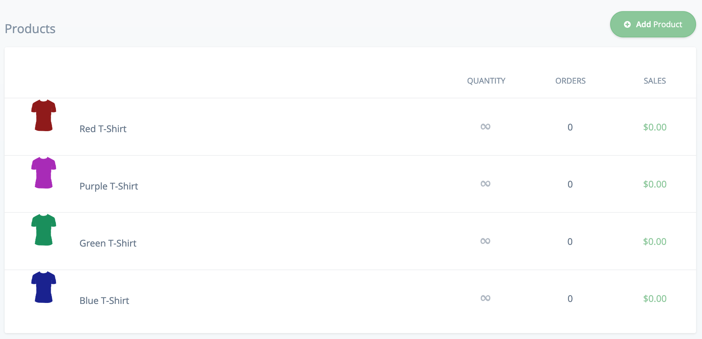
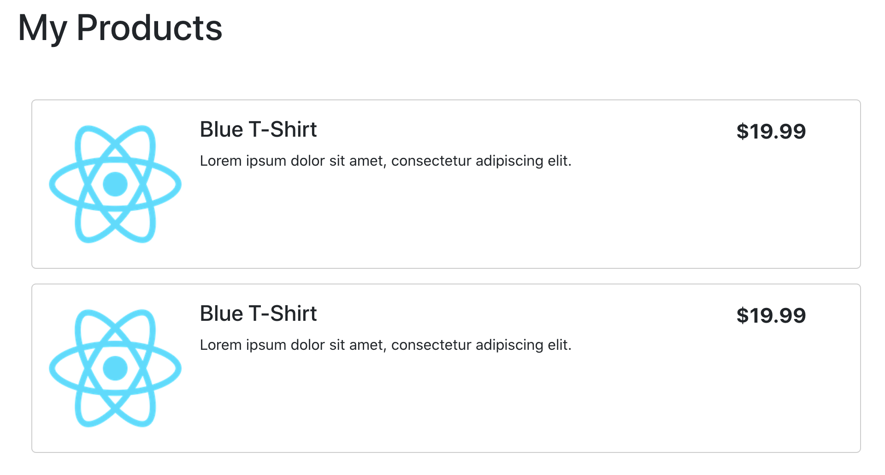

# Listing products with React.js

This guide will illustrate how to create a simple list of products from Chec using Commerce.js and React.js.

## Overview

In this example we will create an application that lists products from Chec. We will:

1. Create a new React app and install the Commerce.js SDK
1. Create React components from a simple HTML template to display static product data
1. Hook up the components to the Chec API using Commerce.js to display live product data

### Requirements

To follow along with this guide you will need:

* A Chec dashboard account. You can [sign up for free](https://dashboard.chec.io/signup) if you don't already have one.
* [Node.js](https://nodejs.org/) version 8 or greater.
* A code editor such as [Visual Studio Code](https://code.visualstudio.com/).

### Prerequisites

To get the most from this guide a working knowledge of HTML and JavaScript will help but isn't necessary. Some knowledge of Node.js and yarn would also help but again isn't required. You will need to be familiar with using the command line/terminal on your computer.

## Check setup

Create some products in your Chec dashboard with at least a name, description, image and price. We won't need many for the purposes of this guide. See the example below of a small number of t-shirts using a basic illustration as the image.



## App setup

Next we'll create the React app, add bootstrap to simplify the styling and install the Commerce.js SDK.

We'll use `create-react-app` to install the base application. this can be called directly using the `npx` too that is part of Node.js. Change directory to the location on your machine where you want to install the app and run the following commands.

```
npx create-react-app react-list-products
cd react-list-products
```
This creates an application called `react-list-products` and changes directory so that we are at the root of the project.

Next add bootstrap.

```
yarn add bootstrap
```

Include the bootstrap CSS in your index.js file just before the application's default `index.css` file.:

*src/index.js*
```
import 'bootstrap/dist/css/bootstrap.css';
import './index.css';
```

Check that your application works by stating the development server. This will automatically open the application in your browser at `http://localhost:3000/`. Changes to the code will hot-reload so you can run it in a separate terminal window and leave it running as we make changes.

```
yarn start
```

### Install Commerce.js

The SDK can be installed in one of two ways. You can include the script from the CDN or install it as a package as part of your application.

To use the CDN add the following line to the `head` of your projects `index.html` file.

*public/index.html*
```
<script type="text/javascript" src="https://assets.chec-cdn.com/v2/commerce.js"></script>
```

To add the SDK as a package in the application run this command.

```
yarn add @chec/commerce.js
```

We'll see how to initialise and use the SDK later.

## Create a static HTML products list

To begin we'll create a static HTML version of how we want our app to look.

For the moment we'll use the React logo image that is included as part of the standard app as a placeholder for our product images so copy it to the `sr` directory.

```
cp public/logo192.png src/
```

And replace the `logo` import in the `App.js` file to import this image.

*src/App.js*
```
import sampleImage from './logo192.png';
```

Now we'll replace the body of the `App` component with some static HTML that we'll extract into components later.

*src/App.js*
```
function App() {
  return (
    <div className="container">
      <header className="header">
        <h1>My Products</h1>
      </header>
      <div className="container main-content">
        <div className="row product">
          <div className="col-md-2">
            
          </div>
          <div className="col-md-8 product-detail">
            <h4>Blue T-Shirt</h4>
            <p>Lorem ipsum dolor sit amet, consectetur adipiscing elit.</p>
          </div>
          <div className="col-md-2 product-price">
            $19.99
          </div>
        </div>
        <div className="row product">
          <div className="col-md-2">
            
          </div>
          <div className="col-md-8 product-detail">
            <h4>Blue T-Shirt</h4>
            <p>Lorem ipsum dolor sit amet, consectetur adipiscing elit.</p>
          </div>
          <div className="col-md-2 product-price">
            $19.99
          </div>
        </div>
      </div>
    </div>
  );
}
```

Add the following CSS after the `code` element in the `index.css` file.

*src/index.css*
```
header {
  padding: 1rem 0;
}

.main-content {
  margin-top: 2rem;
}

.product {
  border: 1px solid #ccc;
  border-radius: 5px;
  padding: 1rem 0;
  margin: 1rem 0;
}

.product-detail {
  padding: 0 2rem;
}

.product-price {
  font-weight: bold;
  font-size: 140%;
}
```

The application should have reloaded an look something like the image below.



## Extract React components

Next we'll extract this static HTML into React components, starting with the product list.

Create a new file `src/components/ProductList.js`. We'll create this as a *class* rather than *functional* component as this will come in useful later. You can read about the difference between the types of component [here](https://medium.com/@Zwenza/functional-vs-class-components-in-react-231e3fbd7108).

```
import React, { Component } from 'react';
import sampleImage from '../logo192.png';

class ProductList extends Component {
  constructor(props) {
    super(props);
  }

  render() {
    return (
      <div className="container main-content">
        <div className="row product">
          <div className="col-md-2">
            
          </div>
          <div className="col-md-8 product-detail">
            <h4>Blue T-Shirt</h4>
            <p>Lorem ipsum dolor sit amet, consectetur adipiscing elit.</p>
          </div>
          <div className="col-md-2 product-price">
            $19.99
          </div>
        </div>
        <div className="row product">
          <div className="col-md-2">
            
          </div>
          <div className="col-md-8 product-detail">
            <h4>Blue T-Shirt</h4>
            <p>Lorem ipsum dolor sit amet, consectetur adipiscing elit.</p>
          </div>
          <div className="col-md-2 product-price">
            $19.99
          </div>
        </div>
      </div>
    );
  }
}

export default ProductList;
```

Import the new component in `App.js`. You can also remove import of `SampleImage`.

*src/App.js*
```
import React from 'react';
import './App.css';
import ProductList from './components/ProductList';

function App() {
  return (
    <div className="container">
      <header className="header">
        <h1>My Products</h1>
      </header>
      <ProductList />
    </div>
  );
}

export default App;
```

Next we'll extract the product row into its own component. Create `src/components/ProductRow.js` with the following code.

*src/components/ProductRow.js*
```
import React from 'react';
import sampleImage from '../logo192.png';

const ProductRow = () => {
  return (
    <div className="row product">
      <div className="col-md-2">
        
      </div>
      <div className="col-md-8 product-detail">
        <h4>Blue T-Shirt</h4>
        <p>Lorem ipsum dolor sit amet, consectetur adipiscing elit.</p>
      </div>
      <div className="col-md-2 product-price">
        $19.99
      </div>
    </div>
  );
}

export default ProductRow;
```

Import the new component into `ProductList.js`. Again, you can remove import of `SampleImage`.

*src/components/ProductList.js*
```
import React, { Component } from 'react';
import ProductRow from './ProductRow';

class ProductList extends Component {
  constructor(props) {
    super(props);
  }

  render() {
    return (
      <div className="container main-content">
        <ProductRow />
        <ProductRow />
      </div>
    );
  }
}

export default ProductList;
```

Your app should look just the same as before in the browser.

Next, we'll hook this up to live product data using Commerce.js.

## Retrieve products from Chec

To begin with we'll alter our product row to be driven by *props*. In React props contain data that are passed into a component in a similar way to attributes on a standard HTML element.

Edit the body of the `ProductRow`.

*src/components/ProductRow.js*
```
const ProductRow = ({ image, name, description, price }) => {
  return (
    <div className="row product">
      <div className="col-md-2">
        
      </div>
      <div className="col-md-8 product-detail">
        <h4>{name}</h4>
        <div dangerouslySetInnerHTML={{__html: description}}></div>
      </div>
      <div className="col-md-2 product-price">
        {price}
      </div>
    </div>
  );
}
```

Note that we've changed the way the description is displayed significantly. Description data from Chec will be in HTML format and React would normally escape that and you would see HTML tags displayed as text in the page. `dangerouslySetInnerHTML` test React that we are expecting HTML in this field and it should be displayed as is.

Once more we can remove the `import` of `sampleImage` in `ProductList.js` since from now on we'll be using real product images from Chec.

Now we can import the Commerce.js SDK in `ProductList.js` and create an instance. You should use your *sandbox public* key which you will find **Setup** > **Developer** in the Chec dashboard.

We'll also update the component to call the `products` API endpoint and display the results.

*src/components/ProductList.js*
```
import React, { Component } from 'react';
import ProductRow from './ProductRow';
import Commerce from '@chec/commerce.js';

const commerce = new Commerce('<your_api_key>');

class ProductList extends Component {
  constructor(props) {
    super(props);

    this.state = {
      products: [],
    }
  }

  componentDidMount() {
    commerce.products.list().then((result) => {
      this.setState({ products: result.data });
    });
  }

  render() {
    return (
      <div className="container main-content">
        {
          this.state.products.map(product => {
            return <ProductRow key={product.id} image={product.media.source} name={product.name} description={product.description} price={product.price.formatted_with_symbol} />
          })
        }
      </div>
    );
  }
}

export default ProductList;
```

Remember to replace `<your_api_key>` with your actual key.

Your app should now be displaying your live products from Chec!


Let's tak a look at what's happened in `ProductList` because we've made a lot of changes.

To begin with we initialised some state in the components constructor, in this case with an empty products list.

```
this.state = {
  products: [],
}
```

And we changed the `render` function to loop over the products list and create a product row for each item. At first this will display no rows because the product list in state is empty.

```
{
  this.state.products.map(product => {
    return <ProductRow key={product.id} image={product.media.source} name={product.name} description={product.description} price={product.price.formatted_with_symbol} />
  })
}
```

Finally we added a `componentDidMount` function that calls the Commerce.js SDK and retrieves the product list. The SDK returns this as a [promise](https://javascript.info/promise-basics). When the promise returns we process it and add the products to the state. In reality you would also want to handle the error state here too but we've skipped that for the sake of brevity.

React automatically notices this change to state and updates the component accordingly, displaying our live product list.

```
  componentDidMount() {
    commerce.products.list().then((result) => {
      this.setState({ products: result.data });
    });
  }
```

And there we are, a React app displaying live product data using the Commerce.js SDK.

You can see a live demo of this [here]().
